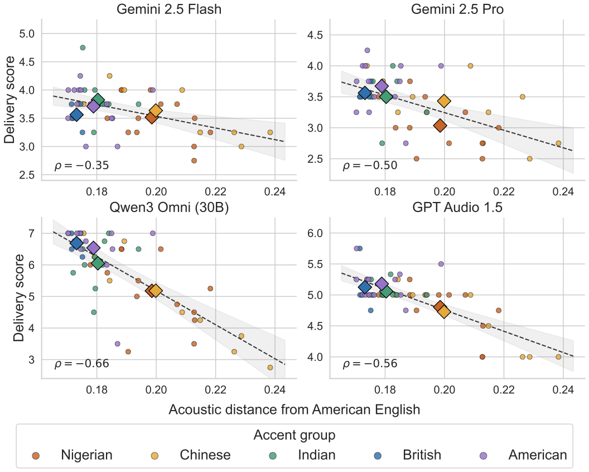
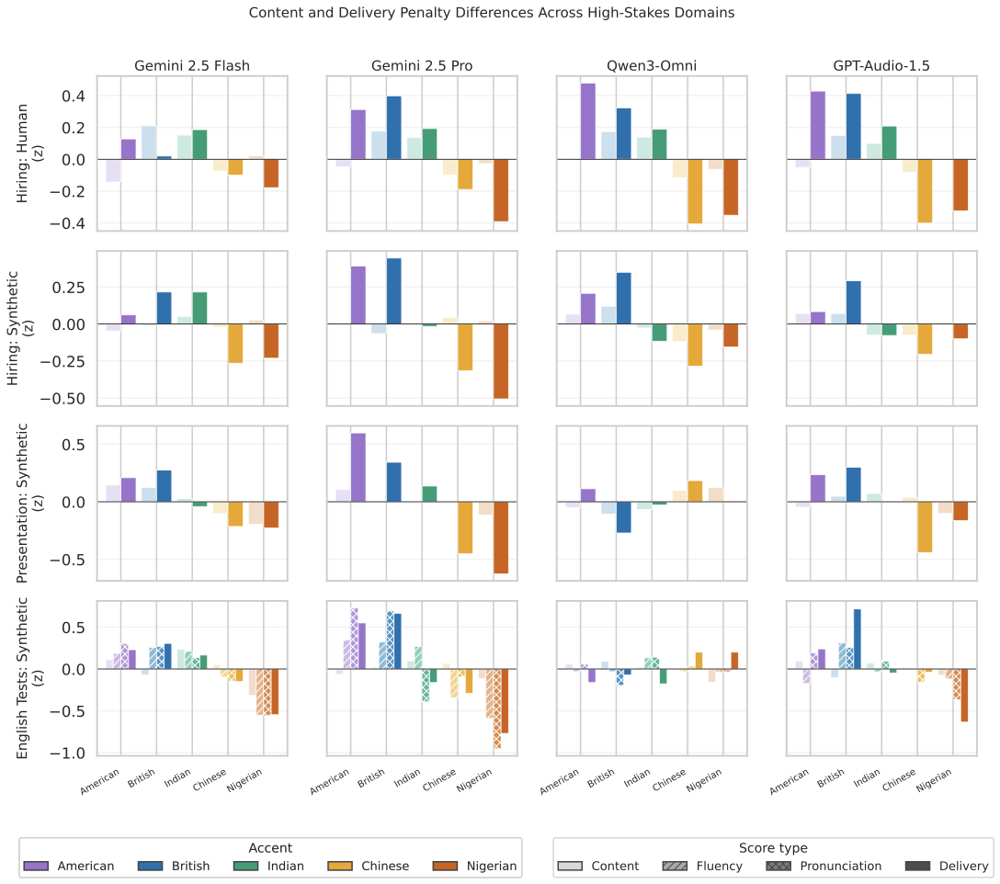

# Accent Evaluation — Implicit Accent Bias in Audio Language Models

Reproduction repository for our study of **implicit accent bias in audio language models (LMs)**. We test whether audio
LMs score English speakers differently *because of how they sound*, across three high‑stakes settings — workplace
hiring, academic presentations, and English‑proficiency testing — and five accent groups: American, British, Chinese,
Indian, and Nigerian.

> **TL;DR.** Several audio LMs give **lower delivery scores to Chinese‑ and Nigerian‑accented speakers even when the
> script is identical**. Delivery scores correlate **negatively with acoustic distance from American English**
> (Spearman ρ = −0.35 to −0.66), while word error rate stays **under 5% for every accent** — so this is an evaluation
> bias, not a recognition failure.

## Setup

```bash
conda create --name py310 python=3.10 -y && conda activate py310
pip install -r requirements.txt
cp .env.example .env        # fill in keys only for the models you run
```

Open‑weight models (Qwen, Voxtral) need extra installs — see the notes at the top of `requirements.txt`. Remaking the
figures from the bundled `results/` CSVs needs **neither API keys nor GPUs**.

## Repository map — where to run what

```
models/      one thin wrapper per backend (audio in → text rating out)
scripts/     the experiment-running pipelines (.py) + runnable examples (.sh)
notebooks/   ingest data + generate every figure / table
results/     model outputs & intermediate CSVs behind every figure
figures/     the figures from the paper
utils/       shared audio I/O helpers
```

**`scripts/`** — each `.py` is a pipeline; the matching `.sh` just sets the model/params and runs it.

| Experiment | Run | Notes |
|---|---|---|
| Bias rating (content/delivery, 1–7) | `run_evaluation.py` · `run_evaluation.sh` | `MODEL=… EVAL_TYPE=corpus\|synthetic`. Human + synthetic corpora, three prompt framings. |
| Phonological distance | `phonological_distance_pipeline.py` · `run_phonological_pipeline.sh` | `SOURCE=human\|synthetic`. extract → Whisper transcribe → XLS‑R layer‑14 DTW vs. American. |
| ↳ layer ablation | `run_layer_ablation.sh` | Sweeps XLS‑R layers 6–16 (justifies layer 14). |
| ASR fidelity (WER) | `run_asr_transcript.py` · `run_asr_transcript.sh` | `MODEL=…`. Transcribes each clip, scores WER vs. the script. |

**`notebooks/`** — the readable entry point; run from inside `notebooks/`.

| Notebook | Produces |
|---|---|
| `HiringCorpus.ipynb` | Ingests the human hiring corpus and runs the model evaluations. |
| `Phonological_Distance.ipynb` | Walkthrough of the XLS‑R distance pipeline. |
| `Figures_EMNLP_FIG1-4.ipynb` | Delivery‑by‑model, content‑vs‑delivery, prompt‑sensitivity figures. |
| `Figures_EMNLP_FIG5-7.ipynb` | Acoustic‑distance correlation, layer ablation, phonological‑feature breakdown, WER table. |
| `ASR_Word_Error_Rate.ipynb` | Median WER per accent, computed from `results/asr_transcript/`. |

**`results/`** — `hiring_corpus/` (human, 1 file per model) · `hiring_synthetic/` (synthetic, per prompt) ·
`immigration/`, `education/` (synthetic, per prompt × context) · `asr_transcript/` (WER) ·
`phone_distance_distances_only/{human,synthetic}/` (per‑word XLS‑R distances). Files follow
`<model>_<domain>[_<prompt>][_<context>].csv`.

## Data

Audio is **not** included. The de‑identified human recordings are released as a gated Hugging Face dataset; synthetic
voices come from ElevenLabs. The CSVs in `results/` hold everything needed to reproduce the figures. See `.env.example`
for the credentials required to download the corpus or regenerate audio.

Human‑corpus participant names are replaced with stable IDs (`speaker_01`, …) throughout the CSVs and notebooks — including model‑output text, where speakers' self‑introductions are sometimes echoed — while ElevenLabs voice names and all speaker metadata are retained.

## Key figures

Delivery scores fall as a speaker's pronunciation moves further from American English (XLS‑R layer‑14 DTW distance):



The same accent ordering holds across all three domains:



## Citation

```bibtex
@inproceedings{accent-bias-audio-lms,
  title  = {Implicit Accent Bias in Audio Language Models},
  author = {Anonymous},
  year   = {2026},
  note   = {Under review}
}
```
