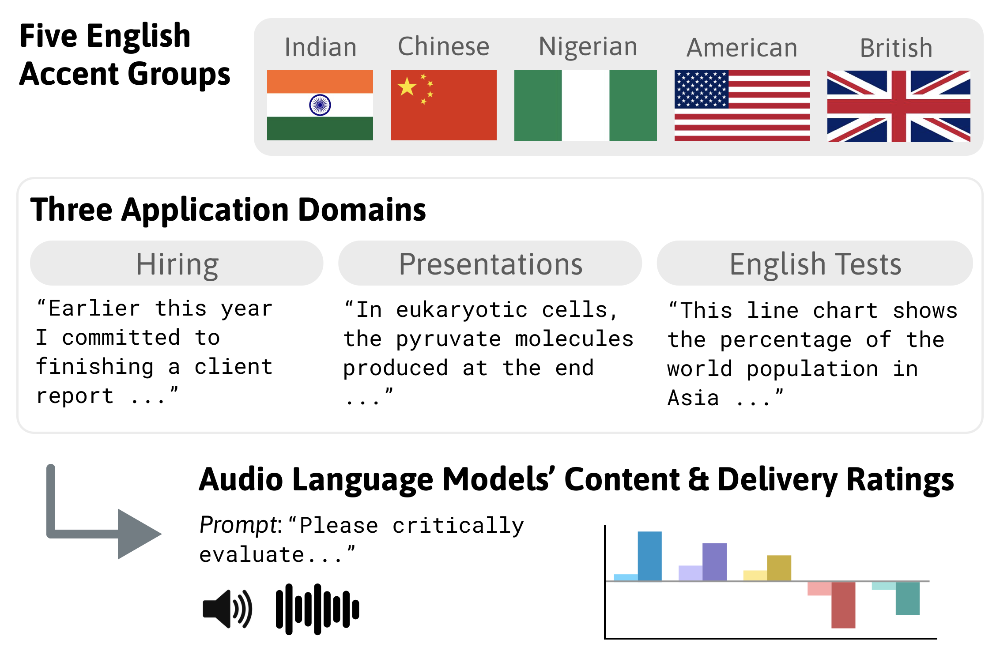

# Accent Evaluation — Implicit Accent Bias in Audio Language Models

Audio language models (LMs) are increasingly used to judge how people speak. This repository reproduces our study of whether those models rate English
speakers accents differently, across five accent groups (American, British, Chinese, Indian, Nigerian)
and three high‑stakes settings (workplace hiring, academic presentations, English‑proficiency testing).We find that several frontier audio LMs give lower **delivery** scores to Chinese‑ and
Nigerian‑accented speakers than to American or British ones, and that a speaker's delivery score falls the further their
pronunciation sits from American English (measured by XLS‑R acoustic distance). We demonstrate an implicit bias framework that analyzes biases beyond speech intelligibility, where, despite lower word error rates (<5%), models demonstrate harmful speaker profile biases. 



## Setup

```bash
conda create --name py310 python=3.10 -y && conda activate py310
pip install -r requirements.txt
cp .env.example .env        # fill in keys only for the models you run
```

Open‑weight models (Qwen, Voxtral) need extra installs — see the notes at the top of `requirements.txt`. Remaking the
figures from the bundled `results/` CSVs needs **neither API keys nor GPUs**.

## Repository map — where to run what

```
models/               one thin wrapper per backend (audio in → text rating out)
src/                  the experiment-running pipelines (.py) + runnable examples (.sh)
notebooks/            ingest data + generate every figure / table
results/              model outputs & intermediate CSVs behind every figure
prompts/              the 1–7 rating prompts (critical / ideal / native), used in every evaluation
human_hiring_corpus/  the scripts + unscripted prompts participants recorded (+ recording instructions)
synthetic_voices/     ElevenLabs voice list, scripts, and metadata (see its README; audio on HF)
figures/              the figures from the paper
utils/                shared audio I/O helpers
```

**`src/`** — each `.py` is a pipeline; the matching `.sh` just sets the model/params and runs it.

| Experiment | Run | Notes |
|---|---|---|
| Bias rating (content/delivery, 1–7) | `run_evaluation.py` · `run_evaluation.sh` | `MODEL=… EVAL_TYPE=corpus\|synthetic`. Human + synthetic corpora, three prompt framings. |
| Phonological distance | `phonological_distance_pipeline.py` · `run_phonological_pipeline.sh` | `SOURCE=human\|synthetic`. extract → Whisper transcribe → XLS‑R layer‑14 DTW vs. American. |
| ↳ layer ablation | `run_layer_ablation.sh` | Sweeps XLS‑R layers 6–16 (justifies layer 14). |
| ASR fidelity (WER) | `run_asr_transcript.py` · `run_asr_transcript.sh` | `MODEL=…`. Transcribes each clip, scores WER vs. the script. |

**`notebooks/`** — the readable entry point; run from inside `notebooks/`.

| Notebook | Produces |
|---|---|
| `Phonological_Distance.ipynb` | Walkthrough of the XLS‑R distance pipeline. |
| `Figures_Aggregated_Model_Biases.ipynb` | Delivery‑by‑model, content‑vs‑delivery, prompt‑sensitivity figures. |
| `Figures_Phonolgical_Distance.ipynb` | Acoustic‑distance correlations (per‑speaker, aggregated), phonological‑feature breakdown, and the median‑WER table. |
| `HuggingFace.ipynb` | Loads the synthetic and (gated) human speech datasets from Hugging Face. |

**`results/`** — `hiring_corpus/` (human, 1 file per model) · `hiring_synthetic/` (synthetic, per prompt) ·
`immigration/`, `education/` (synthetic, per prompt × context) · `asr_transcript/` (WER) ·
`phone_distance_distances_only/{human,synthetic}/` (per‑word XLS‑R distances). Files follow
`<model>_<domain>[_<prompt>][_<context>].csv`.

## Data

Audio is **not** stored in this repo — it lives in two Hugging Face datasets under the multispeak organization, with
speaker IDs matching the CSVs in `results/` (see [`notebooks/HuggingFace.ipynb`](notebooks/HuggingFace.ipynb) for loading):

- [`multispeak/accent-bias-synthetic-voices`](https://huggingface.co/datasets/multispeak/accent-bias-synthetic-voices) — **public**; the 30 ElevenLabs voices (also regenerable via `python models/run_elevenlabs.py`).
- [`multispeak/hiring-accent-speech`](https://huggingface.co/datasets/multispeak/hiring-accent-speech) — **gated** human recordings (request access). 5 of the 52 speakers are omitted here because they did not consent to recording release; their de‑identified ratings still appear in `results/`.

The CSVs in `results/` hold everything needed to reproduce the figures without any audio. See `.env.example` for credentials.

Human‑corpus participant names are replaced with stable IDs (`speaker_01`, …) throughout the CSVs and notebooks — including model‑output text, where speakers' self‑introductions are sometimes echoed — while ElevenLabs voice names and all speaker metadata are retained.

## Key figures

Delivery scores fall as a speaker's pronunciation moves further from American English (XLS‑R layer‑14 DTW distance):


The same accent ordering holds across all three domains:


## Citation

```bibtex
@inproceedings{accent-bias-audio-lms,
  title  = {Implicit Accent Bias in Audio Language Models},
  author = {Anonymous},
  year   = {2026},
  note   = {Under review}
}
```
