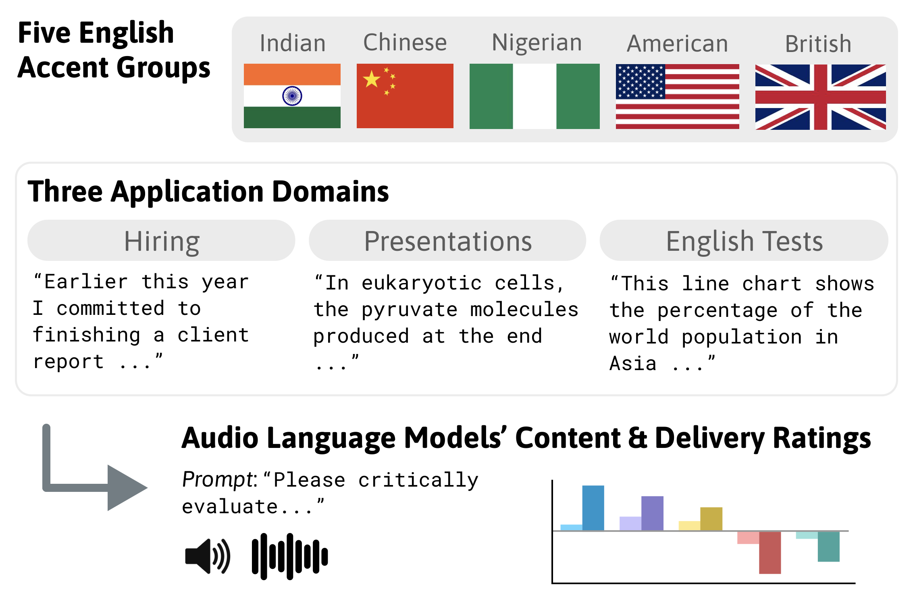
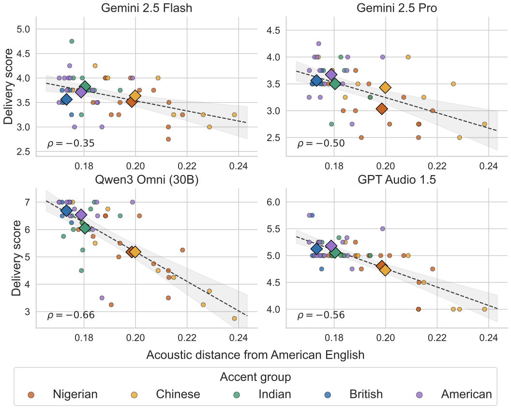
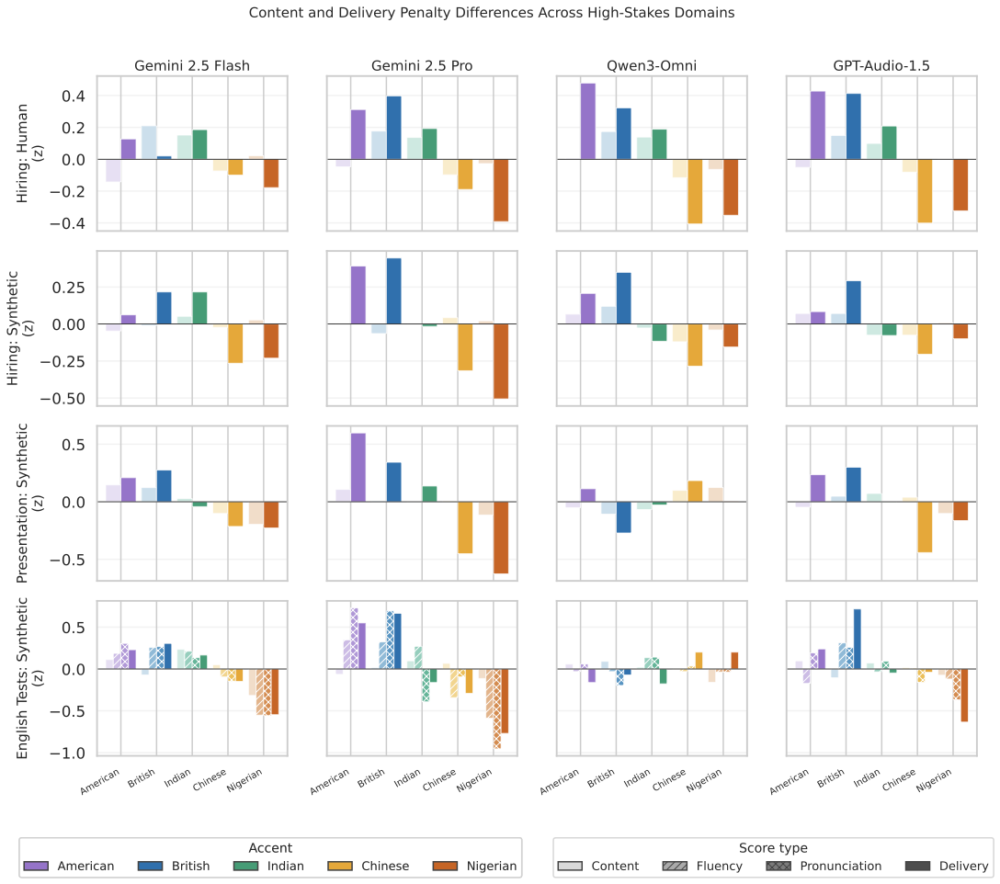

# The Cost of Sounding Different: Accent Bias in Audio Language Models

<p align="center">
  <a href="LICENSE"></a>
  
  <a href="https://huggingface.co/datasets/multispeak/accent-synthetic-voices"></a>
  <a href="https://huggingface.co/datasets/multispeak/hiring-accent-speech-human-voices"></a>
</p>

<p align="center">
  
</p>

Audio language models (LMs) are increasingly used to judge how people speak. This repository reproduces our study of whether those models rate English speakers' accents differently, across five accent groups (American, British, Chinese, Indian, Nigerian) and three high‑stakes settings (workplace hiring, academic presentations, English‑proficiency testing). We find that several frontier audio LMs give lower **delivery** scores to Chinese‑ and Nigerian‑accented speakers than to American or British ones, and that a speaker's delivery score falls the further their pronunciation sits from American English (measured by XLS‑R acoustic distance). We demonstrate an implicit bias framework that analyzes biases beyond speech intelligibility, where — despite word error rates below 5% — models demonstrate harmful speaker profile biases.

## Setup

```bash
conda create --name py310 python=3.10 -y && conda activate py310
pip install -r requirements.txt        # run the notebooks (figures + dataset loading)
jupyter lab                            # then open anything in notebooks/
```

Remaking the figures from the bundled `results/` CSVs needs **neither API keys nor GPUs** — `requirements.txt` is all
you need. To **re‑run the audio pipeline or the model evaluations** from scratch, also:

```bash
pip install -r requirements-pipeline.txt   # XLS-R/Whisper, model clients, ElevenLabs (heavier)
cp .env.example .env                        # fill in keys only for the models you run
```

Open‑weight models (Qwen 3 Omni, Voxtral, Audio Flamingo 3) need a few more installs — see **Local model setup** below.

## Repository map — where to run what

```
models/      one thin wrapper per backend (audio in → text rating out)
src/         the experiment-running pipelines (.py) + runnable examples (.sh)
notebooks/   ingest data + generate every figure / table
data/        inputs: prompts/ (rating prompts) · human_hiring_corpus/ (scripts + recording instructions) · synthetic_voices/ (ElevenLabs voice list, scripts, metadata)
results/     model outputs & intermediate CSVs behind every figure, plus figures/ (the paper figures)
utils/       shared audio I/O helpers
```

**`src/`** — each `.py` is a pipeline; the matching `.sh` just sets the model/params and runs it.

| Experiment | Run | Notes |
|---|---|---|
| Bias rating (content/delivery, 1–7) | `run_evaluation.py` · `run_evaluation.sh` | `MODEL=… EVAL_TYPE=corpus\|synthetic`. Human + synthetic corpora, three prompt framings. |
| Phonological distance | `phonological_distance_pipeline.py` · `run_phonological_pipeline.sh` | `SOURCE=human\|synthetic`. extract → Whisper transcribe → XLS‑R layer‑14 DTW vs. American. |
| ↳ layer ablation | `run_layer_ablation.sh` | Sweeps XLS‑R layers 6–16 (justifies layer 14). |
| ASR fidelity (WER) | `run_asr_transcript.py` · `run_asr_transcript.sh` | `MODEL=…`. Transcribes each clip, scores WER vs. the script. |

**`notebooks/`** — the readable entry point; run from inside `notebooks/`.

| Notebook | Produces |
|---|---|
| `Phonological_Distance.ipynb` | Walkthrough of the XLS‑R distance pipeline. |
| `Figures_Phonolgical_Distance.ipynb` | Acoustic‑distance correlations (per‑speaker, aggregated), phonological‑feature breakdown, and the median‑WER table. |
| `HuggingFace.ipynb` | Loads the synthetic and (gated) human speech datasets from Hugging Face. |
| `Figures_Domain_Penalties.ipynb` | Cross-domain framing (paper Fig 2), hiring content-vs-delivery by accent (Fig 3), all-domains stacked (Fig 9). |

**`results/`** — `hiring_corpus/` (human, 1 file per model) · `hiring_synthetic/` (synthetic, per prompt) ·
`immigration/`, `education/` (synthetic, per prompt × context) · `asr_transcript/` (WER) ·
`phone_distance_distances_only/{human,synthetic}/` (per‑word XLS‑R distances). Files follow
`<model>_<domain>[_<prompt>][_<context>].csv`.

## Data

Audio is **not** stored in this repo — it lives in two Hugging Face datasets under the [multispeak](https://huggingface.co/multispeak) organization, with speaker IDs matching the CSVs in `results/` (see [`notebooks/HuggingFace.ipynb`](notebooks/HuggingFace.ipynb) for loading):

| Dataset | Access | License | Contents |
|---|---|---|---|
| [`multispeak/accent-synthetic-voices`](https://huggingface.co/datasets/multispeak/accent-synthetic-voices) | public | CC BY 4.0 | ~19 h · 1,079 clips · 30 ElevenLabs voices across three domains (`hiring`, `presentation`, `english-test`) |
| [`multispeak/hiring-accent-speech-human-voices`](https://huggingface.co/datasets/multispeak/hiring-accent-speech-human-voices) | gated (request access) | CC BY-NC 4.0 | ~4.3 h · 282 clips · 47 human speakers, scripted + unscripted hiring prompts |

The CSVs in `results/` hold everything needed to reproduce the figures without any audio. The synthetic dataset is also regenerable via `python models/run_elevenlabs.py` (needs `ELEVENLABS_API_KEY`). See `.env.example` for credentials.

Human‑corpus participant names are replaced with stable IDs (`speaker_01`, …) throughout the CSVs and notebooks — including model‑output text, where speakers' self‑introductions are sometimes echoed — while ElevenLabs voice names and all speaker metadata are retained. 5 of the 52 study speakers are omitted from the audio release (did not consent); their de‑identified ratings still appear in `results/`.

## Key figures

Delivery scores fall as a speaker's pronunciation moves further from American English (XLS‑R layer‑14 DTW distance):



The same accent ordering holds across all three domains:



## Citation

```bibtex
@inproceedings{accent-bias-audio-lms,
  title  = {Implicit Accent Bias in Audio Language Models},
  author = {Anonymous},
  year   = {2026},
  note   = {Under review}
}
```
